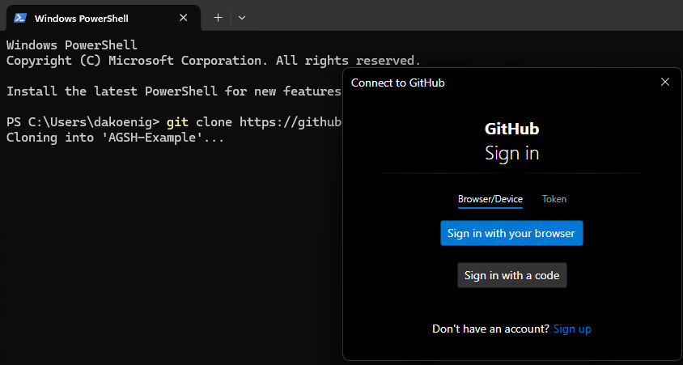
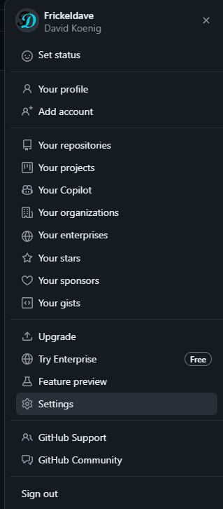

# Lession 03 - GitHub repository erstellen

Alle Dateien die für die Verwaltung der Umgebung notwendig sind, werden in einem privaten Repository verwaltet. Privat deswegen, weil in dem Repository 2 wesentlichen Secrets verwaltet werden (mehr dazu in späteren Lessions). In diesem Kapitel wird erläutert, wie das repository angelegt und auf das Entiwcklungssystem gecloned wird.

## Anlegen des Repositories

Melde dich bei deinem GitHub Account an, wechsel in den Bereich "Repositories" und lege ein neues Repository an. Vergib einen Namen, eine Beschreibung und setze das Repository auf "Privat". Füge zudem ein "README.md" file hinzu, was dazu führt, dass das Repository gleich initialisiert ist. 

## Clone des repositories erstellen

Öffne nun eine Powershell Konsole und clone das Repository. Du hast nun die Möglichkeit, dich entweder über Web/SSO zu authentifizieren (empfohlen) oder ein "Poersonal access token" zu nutzen (wenn keine UI oder kein Browser) zur Verfügung steht.

.

## Personal access token (PAT) erstellen

**Wenn du dich via Web/SSO authentifizierst, kannst du dieses Kapitel überspringen.**

Um ein PAT zu erstellen, klicke in GitHub oben rechts auf den Benutzersymbol und wechsel in die Sektion "Settings". 

- [Zurück zur Startseite](./../README.md)
- [Voriges Kapitel](./../Lesson02-Install_Ubuntu/Lesson02.md)
- [Nächstes Kapitel](./../Lesson04-Install_GH_Runner/Lesson04.md)
