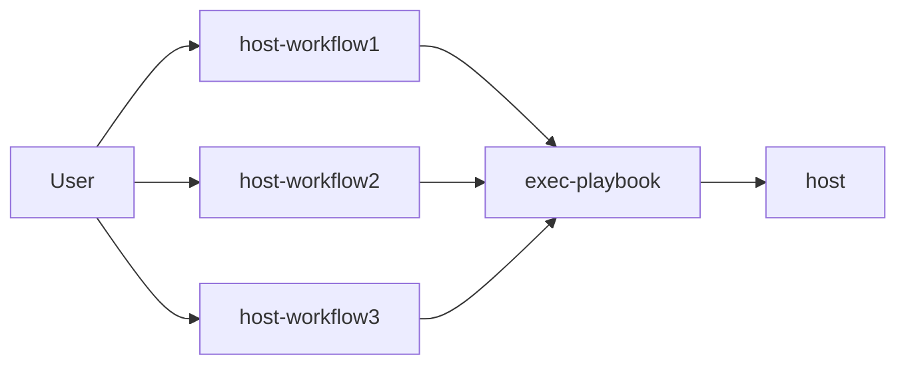

# Lesson 08 - Starten eines playbooks über eine GitHub Action

Wir haben un eine voll funktionstüchtige Ansible Installation. Allerdings war der Aufruf des ```ansible-playbook``` commands eher schwer zu merken und je nach Situation kommen noch einige Parameter hinzu. Das wollen wir natürlich etwas vereinfachen. Und da wir so gute Erfahrungen mit dem Einsatz von GitHub Actions gemacht haben, drängt es sich ja nahezu auf, diese auch als GUI für die Ausführung der Playbooks zu verwenden.

In diesem Kapitel werden wir also für jeden unserer Hosts (Also nur der "master") einen Workflow anlegen. Jeder dieser Workflows ist einzeln ansteuerbar. Zum erstellen wir ein Workflow, der alle Parameter für "ansible-playbook" konsolidiert und von den "host-workflows" aufgerufen werden kann.



## "exec-playbook" workflow

Kopiere die Datei "exec-playbook.yaml in das Zielverzeichnis *.github/workflows* deines Repositories. Im ersten Abschnitt siehst du, dass der Workflow auf die Action "workflow_call" hört. Dies bedeutet, dass der Workflow von anderen Workflwos aufgerugen werden muss.

```yaml
name: exec-playbook
on: 
  workflow_call:
  ...
  ...
```

Wenn du (nach einem Push) einen Blick auf deine GitHub Actions wirfst, wirst du sehen, dass zwar der Workflow "exec-playbook" vorhanden ist, aber du keine Möglichkeit hast, diesen aufzurufen.


In der uweiten Sektion findest du diverse Eingabevariablen. Diese können verwendet werden, um die Ausführung entsprechend anzupassen.

- **ans_target_playbook** -> Das Playbook welches ausgeührt werden soll
- **ans_limit** -> Gegen welche Systeme soll das Playbook ausgeführt werden. Dies ist eine einschrnkende Variable, nutze das Stichwort "all" um das Playbook gegen alle Systeme auszuführen. Du kannst dann weitere Einschränkungen direkt im playbook treffen.
- **ans_vars** -> Welche variablen sollen übergeben werden, die die Ausführung beeinflussen (und z.B. von Rollen verwendet werden sollen)

```yaml
...
...
      ans_target_playbook:
        description: The relative path to the playbook (MyPlaybook.yaml)
        required: false
        default: invalid.yaml
        #default: "-o UserKnownHostsFile=/dev/null -o StrictHostKeyChecking=no"
        type: string
      ans_limit:
        description: The limitation to run the playbook
        required: true
        default: "invalid"
        type: string
      ans_vars:
        description: The variables that should be given to the playbook
        required: false
        default: ""
        type: string
...
...

```

Als letztes folgt der Task der ausgeführt werden soll. Es wird das finale Command "ansible-playbook" mit den Variablen zusammengestellt und ausgeführt.

```yaml

jobs:

  execute-playbook:
    runs-on: self-hosted
    steps:

      - name: Execute the playbook
        run: | 
          source ~/ansible/bin/activate
          cd ~/ansible/ansible
          ansible-playbook ./playbooks/${{ inputs.ans_target_playbook }} --private-key "~/ansible/ansible/.ssh/ansible_ssh.key" -u ansible --ssh-extra-args "-o StrictHostKeyChecking=no" --limit ${{ inputs.ans_limit }} --extra-vars "${{ inputs.ans_vars }}"
          deactivate

```

## host-master workflow

Alles gut und schön, wir haben aber immer noch keinen hübschen Button auf den wir klicken können. Eigentlich können wir gerade gar nichts ausführen. Das ändern wir nun. Legen wir auch dafür einen Workflow an. Kopiere hierfür die Datei "host-master.yaml" in das Zielverzeichnis *.github/workflows* deines Repositories und pushe die Änderung. Währenddessen ein bisschen Theorie.

Im Header der Datei findest du diesmal die Action "workflow_dispatch". Durch diesen Action-Type erhälst du in der GitHub Oberfläche einen Button. Klickst du diesen an, werden automatisch Eingabefelder generiert, die deine "Inputs" wiederspiegeln.

```yaml

name: host-master
on: 
  workflow_dispatch:
    inputs:
      agsh_message:
        description: A message that should be shown in ansible output
        required: false
        default: "'A stupid message'"

```


In der "jobs Sektion des Workflows wird mit dem "uses" Command der "exec-playbook" Workflow aufgerufen und die drei oben geannten Variablen übergeben.

```yaml

jobs:

  execute-ansible:
    uses: ./.github/workflows/exec-playbook.yaml
    with:
      ans_target_playbook: master01.yaml
      ans_limit: master
      ans_vars: agsh_message=${{ inputs.agsh_message }}

```

## Ausführung

Führe nun den Workflow aus. Du solltest eine Kommandozeilenausgabe mit der Nachricht "A stupid message" erhalten. Zudem siehst du den gesamte "Stack" der ausgeführten Workflows.

.

- [Zurück zur Startseite](./../README.md)
- [Voriges Kapitel](./../Lesson07-add_ansible_files/Lesson07.md)
- [Nächstes Kapitel](./../Lesson09-Installation_of_a_baseline/Lession09.md)